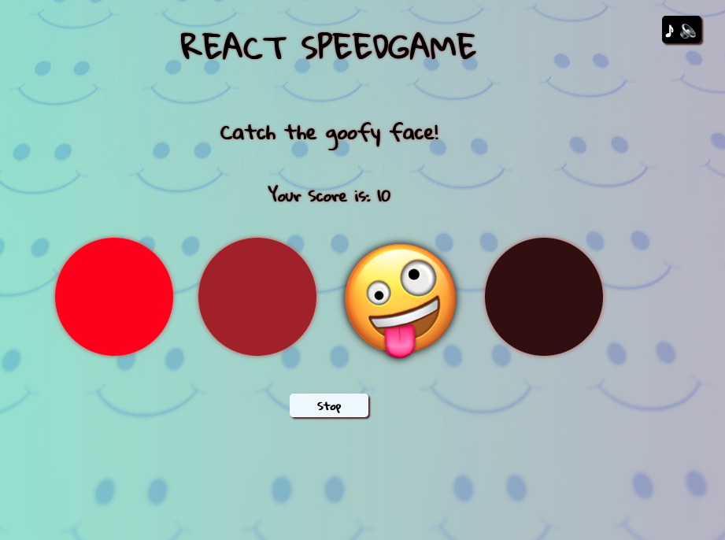

# Speedgame made in React
## General Information

This is a simple clicking game built with React tools, using only Class and Function Components (no Hooks). This is the second version of the same project, the [first one](https://github.com/hiphip12/speedgame) was made with vanilla JavaScript. Both os these project were part of a school assignment, and -as a beginner- both projects were equally challenging.

## Technologies
- React
- JavaScript
- HTML
- CSS

## Instructions

1. There are 5 rounds in which you need to click the goofy face that appears randomly across four circles.
2. The pace is fast and you need to aim at 50 points (5 clicks) before the round is over.
3. You can try as many times you want, while having some nice music in the background.

## Screenshot

## Live Page

Play it [here](https://public.bc.fi/s2300106/react_speedgame/)

## Credits

Asset credits are listed in the ASSETS_CREDITS.TXT file under 'scr' folder.

The task itself and guidance were provided by the excellent [Margit Tennosaar](https://github.com/margittennosaar) during April/May 2023 @Helsinki Business College.

