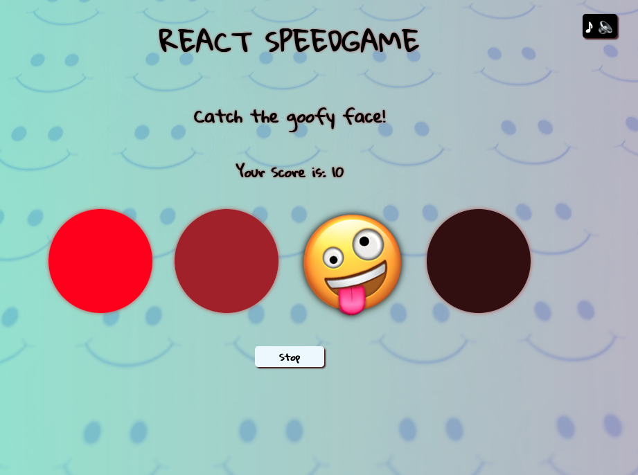

# Speedgame Made in React
## General Information

This is a school project where a simple clicking game was built with React tools using only Class and Function Components. This is the second version of the same project, since the [first one](https://github.com/hiphip12/speedgame) was made with vanilla JavaScript at the inital stages of the webdev course. As a beginner, both projects were equally challenging.

## Technologies
- React
- JavaScript
- HTML
- CSS

## Instructions

1. There are 5 rounds in which you need to click the goofy face that appears randomly across four circles.
2. The pace is fast and you need to aim at 50 points (5 clicks) before the round is over.
3. You can try as many times you want, while having some nice music in the background.

## Screenshot

## Live Page

Play it [here](https://public.bc.fi/s2300106/react_speedgame/)

